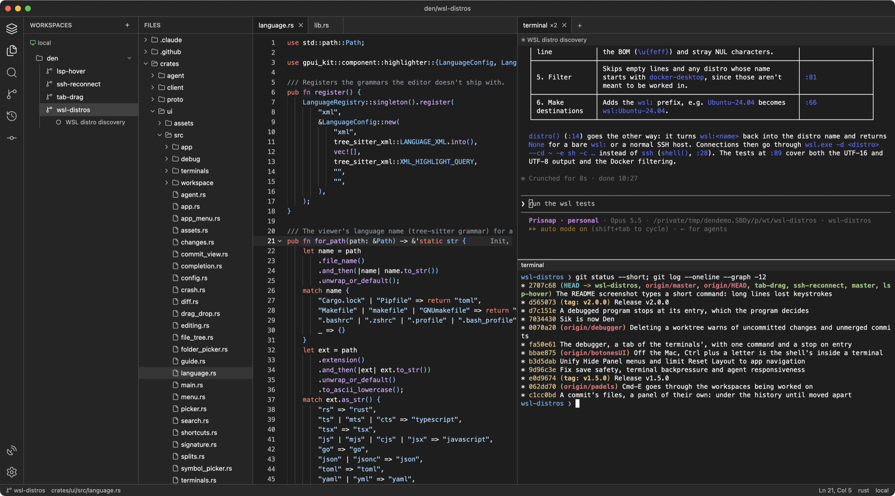

<p align="center">
  
</p>

<h1 align="center">sik</h1>

<p align="center">
  A native workspace for coding agents: persistent terminals and a code editor side by side,<br>
  where every task is a git worktree, on your machine or on any server over SSH.
</p>

<p align="center">
  
</p>

- **Tasks.** The tasks of all your servers in one column; switching tasks switches the file tree, changes, search and terminals at once. A dot per task: red when Claude is asking something, yellow while it works, green when it finished unseen. No hooks: sik reads the terminals.
- **Terminals that don't die.** They live in an agent that survives closing the app or losing SSH, and reattach with their history.
- **Code next to the agent.** Tree-sitter highlighting, F12, Shift-F12, completions and signatures over LSP, search, Cmd-P, Markdown and images; Cmd-click a `file:line` in a terminal to open it.
- **Git.** Uncommitted changes, stage, commit, the history (of everything or of one file) and side-by-side diffs. Open a commit to see its message, author, date and all its file changes together; click a file name to open its diff in a separate tab. Only the local repo: pushing and pulling is left to you.
- **Remote like local.** A server is a name from `~/.ssh/config`; sik uploads its agent and everything works as it does locally.

## Install

Download a package from [Releases](https://github.com/scorredoira/sik/releases).

| Platform | Package | Installation |
| --- | --- | --- |
| macOS 15+, Apple Silicon | `sik-<version>-macos-aarch64.zip` | Unzip and drag `Sik.app` to Applications. |
| macOS 15+, Intel | `sik-<version>-macos-x86_64.zip` | Unzip and drag `Sik.app` to Applications. |
| Linux x86_64, Ubuntu 24.04 or compatible | `sik-<version>-linux-x86_64.tar.gz` | Extract and run `./install.sh`, or run `./sik` directly. |
| Windows 10/11 x64 | `sik-<version>-windows-x86_64.zip` | Extract the whole folder and open `sik.exe`. Optional: run `install.ps1` for a per-user install and Start menu shortcut. |

**macOS first launch:** releases are ad hoc signed, without notarization. After trying to open Sik, go to System Settings → Privacy & Security → Open Anyway. See [Apple's instructions](https://support.apple.com/102445). A normal download may be blocked until you authorize it.

**Linux:** a graphical Wayland or X11 session and a working Vulkan driver are required. On Ubuntu 24.04, install runtime dependencies with `sudo apt install libfontconfig1 libwayland-client0 libwebkit2gtk-4.1-0 libxkbcommon-x11-0 libx11-xcb1 libssl3t64 libzstd1 libvulkan1`. The optional installer also needs Python 3. Packages built on Ubuntu 24.04 require its glibc baseline; they are not universal binaries for older distributions.

**Windows:** releases are unsigned, so Windows may show a publisher/SmartScreen warning. Install Git for Windows and the Windows OpenSSH client and make `git` and `ssh` available on PATH. The default terminal is PowerShell (PowerShell 7 when installed). Keep the bundled agent next to `sik.exe`. Close the app before replacing an installed release.

Git must be installed on every machine where you use repositories. SSH connections currently support Linux x86_64 servers; every desktop package includes their static agent. Install Claude Code and any language servers you use separately.

Every release includes `SHA256SUMS`. On macOS use `shasum -a 256 <archive>`; on Linux use `sha256sum <archive>`; on Windows use `Get-FileHash <archive> -Algorithm SHA256`.

To build from source, install Rust and the native dependencies from the [GPUI Kit installation guide](https://gpui-kit.com/docs/installation/), then run:

```sh
git clone https://github.com/scorredoira/sik && cd sik
cargo build --release --locked -p ui -p agent
```

Both executables are in `target/release`. On macOS, `./install` builds and installs `Sik.app`; `./run` opens a development build. To include the Linux SSH agent when building on macOS, install `cargo-zigbuild` and Zig first.

## Publishing releases

CI builds, tests and packages macOS Apple Silicon, macOS Intel, Linux and Windows on every branch push and pull request. Packages can be downloaded from the successful workflow's artifacts before publishing. No signing certificates or extra repository secrets are needed.

Once your changes are committed, publish a new version from the repository root:

```sh
./release 0.1.1
# Windows: python packaging/release.py 0.1.1
# Preview without changes: ./release 0.1.1 --dry-run
```

This updates the workspace version and lockfile, creates a version commit and an annotated tag, and pushes the branch and tag together. The `Release` workflow runs the tests and publishes all four packages with checksums and generated release notes only after every build succeeds. Use a version such as `0.2.0-beta.1` for a prerelease. Publishing takes several minutes; the first build is slower while caches fill.

Alternatively, update `Cargo.toml` and `Cargo.lock`, commit and push, then open **Actions → Release → Run workflow** on that branch. It publishes the version in `Cargo.toml` and creates its tag. A manually pushed `v<version>` tag also triggers publication; the tag must match the manifest. Existing releases are never overwritten. Uploads are assembled in a draft before becoming public; if an upload fails, delete that incomplete draft before rerunning the publication. If a build fails before publication, fix the failure and use a new version, or rerun a transient failure on the same commit.

macOS packages use ad hoc signing and Windows packages are unsigned. GUI behavior and installation should also be checked on real machines; CI tests the code and builds packages but does not exercise a real desktop session.

## Opening from a terminal

`sik <path>` opens a folder, or a file in its repo, as a workspace in sik. It works from any terminal: the agent links `sik` into `~/.local/bin` if that folder exists. Over SSH it opens in the app connected to that server.

## Workspaces

The workspaces column lists, per server, the folders opened and the known repos, each repo's worktrees folded under its checkout. Drag to reorder: a checkout moves along with its worktrees.

New Worktree (Cmd-N) creates one with the repo's executable `.sik/create <name>` if it has one, or `git worktree add` otherwise. From a sik terminal: `cd "$(sik worktree <name>)"`.

On Windows, repository hooks can use `.sik/create.ps1`, `.sik/remove.ps1` and `.sik/format.ps1` (also `.cmd`, `.bat` or `.exe`). Extensionless hooks need `sh` on PATH. PowerShell terminals report their current directory automatically; custom shells should emit OSC 7 for directory tracking.

Format Document (Shift-Opt-F), and Format on Save for the types chosen in Settings, use the repo's executable `.sik/format <file>` if it has one (the text on stdin, the result on stdout; exiting with 2 leaves that type to the next way), else the language server; JSON is formatted even without either.

Cmd-1…9 go to a workspace, Cmd-E back to the previous one, Cmd-K finds one across servers. Every shortcut can be changed in Settings (Cmd-,).

## Updates

An installed Sik (`Sik.app` on macOS, or installed with the Linux package's `install.sh`) checks for a new release every few hours, installs it and restarts into it: right away if nothing is unsaved, otherwise once it is, or with the title bar's button. Terminals keep running in the agent across the restart.

Drag a terminal tab to the left, right, top or bottom edge of another terminal to split the area. In a split, drag a pane's title back to the tab bar to separate it again. Escape cancels the drag; sessions and their history stay open.

## How it's built

Rust and [GPUI](https://www.gpui.rs) with [gpui-component](https://github.com/longbridge/gpui-component). The app only draws; every machine runs `sik-agent`, which keeps the terminals and does search, git and LSP next to the files, over a local socket or `ssh`. `plan.md` has the design and what's left.

## License

GPL-3.0. Inspired by [herdr](https://github.com/herdrdev/herdr) (Apache-2.0), whose rules for detecting when Claude Code is waiting for an answer sik uses, with code adapted from [Zed](https://github.com/zed-industries/zed) (GPL-3.0).
