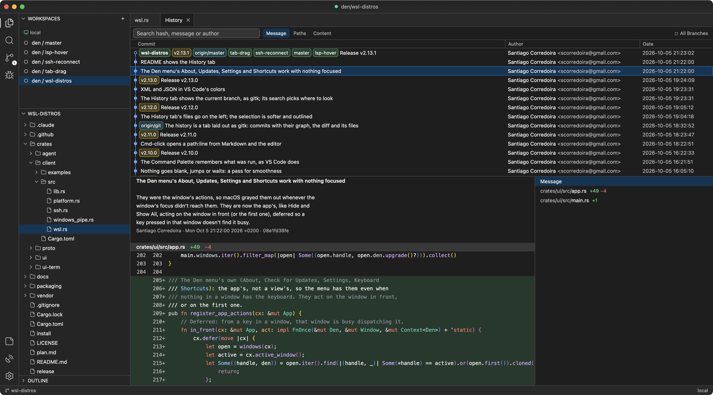
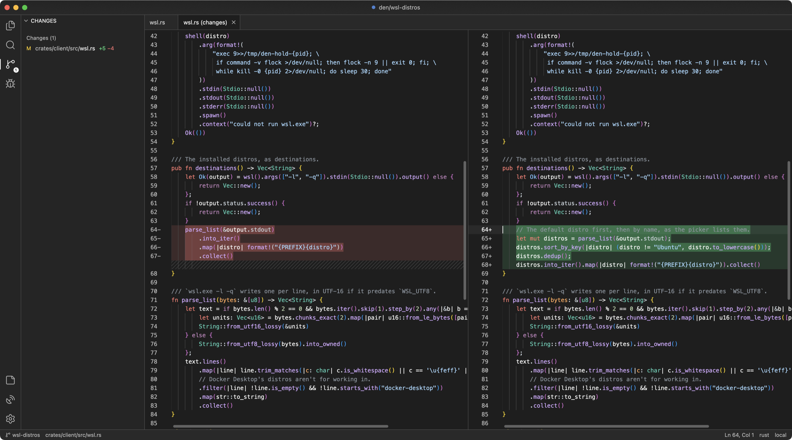
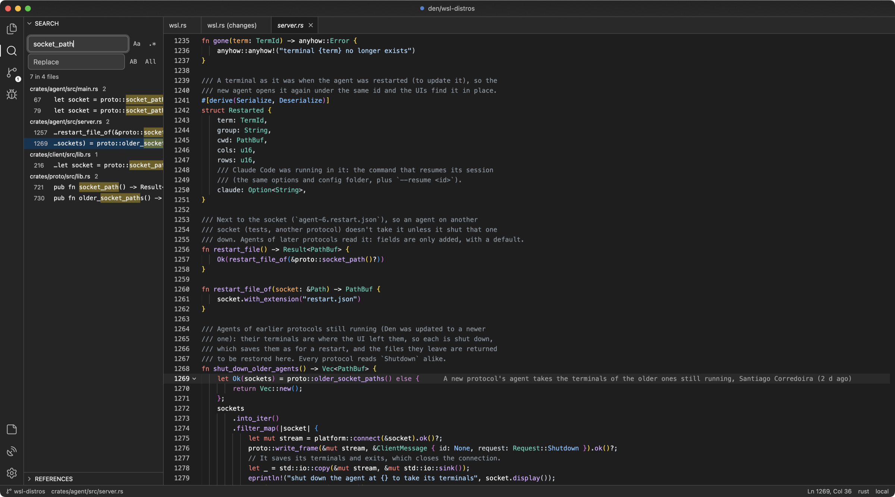
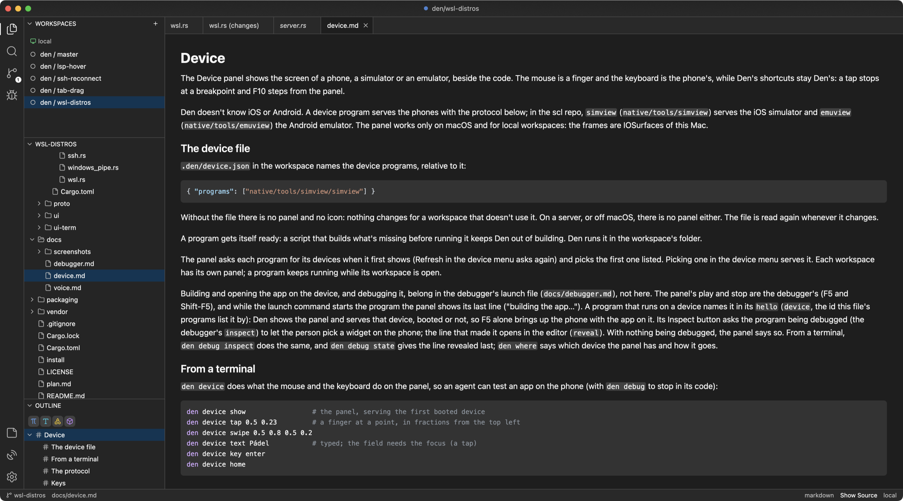

  

<h1 align="center">Den</h1>

  A native environment for working with coding agents, written in Rust. 
  A code editor, a multiplexer of persistent terminals and git in one app, on your machine or on any server over SSH.

  

- **Native, in Rust.** GPU-rendered with GPUI, no Electron. macOS, Linux and Windows.
- **Terminals that outlive the app.** They run in `den-agent`, like tmux: close Den, update it or lose the connection and Claude keeps working.
- **Every agent at a glance.** Each workspace has a dot for its coding agents: red asking, yellow working, green done. Cmd-E jumps to the next one.
- **Remote like local.** A server is a name from `~/.ssh/config`: terminals, search, git and language servers run next to the files.

## Git

The history as gitk shows it, side-by-side diffs and the blame of the current line. Den only reads: commit and push from a terminal.

  
  

## Code

Tree-sitter highlighting, language servers, project search, go to file, an outline, split editors, Markdown and images. Cmd-click a `file:line` anywhere to open it.

  
  

## And

- **Agents drive Den.** With the `den` command Claude shows you code, diffs and reports, and opens and reads terminals. Den installs a Claude Code skill so Claude knows how.
- **A debugger** for any program that speaks [Den's debug protocol](docs/debugger.md): breakpoints, stepping, values in the code.

## Install

Download a package from [Releases](https://github.com/scorredoira/den/releases).

Download a package from [Releases](https://github.com/scorredoira/den/releases).

| Platform | Package | Installation |
| --- | --- | --- |
| macOS 15+, Apple Silicon | `den-<version>-macos-aarch64.zip` | Unzip and drag `Den.app` to Applications. |
| macOS 15+, Intel | `den-<version>-macos-x86_64.zip` | Unzip and drag `Den.app` to Applications. |
| Linux x86_64, Ubuntu 24.04 or compatible | `den-<version>-linux-x86_64.tar.gz` | Extract and run `./install.sh`, or run `./den` directly. |
| Windows 10/11 x64 | `den-<version>-windows-x86_64.zip` | Extract the whole folder and open `den.exe`. Optional: run `install.ps1` for a per-user install and Start menu shortcut. |

On macOS, releases aren't notarized: the first time, open Den from System Settings → Privacy & Security → Open Anyway. Requirements per platform and building from source: [docs/install.md](docs/install.md).

## Docs

- [Using Den](docs/guide.md): opening from a terminal and the `den` command, workspaces, layout, debugging, updates.
- [The debug protocol](docs/debugger.md).
- [Publishing releases](docs/releasing.md).

## License

GPL-3.0. Inspired by [herdr](https://github.com/herdrdev/herdr) (Apache-2.0), whose rules for detecting when Claude Code is waiting for an answer Den uses, with code adapted from [Zed](https://github.com/zed-industries/zed) (GPL-3.0).
