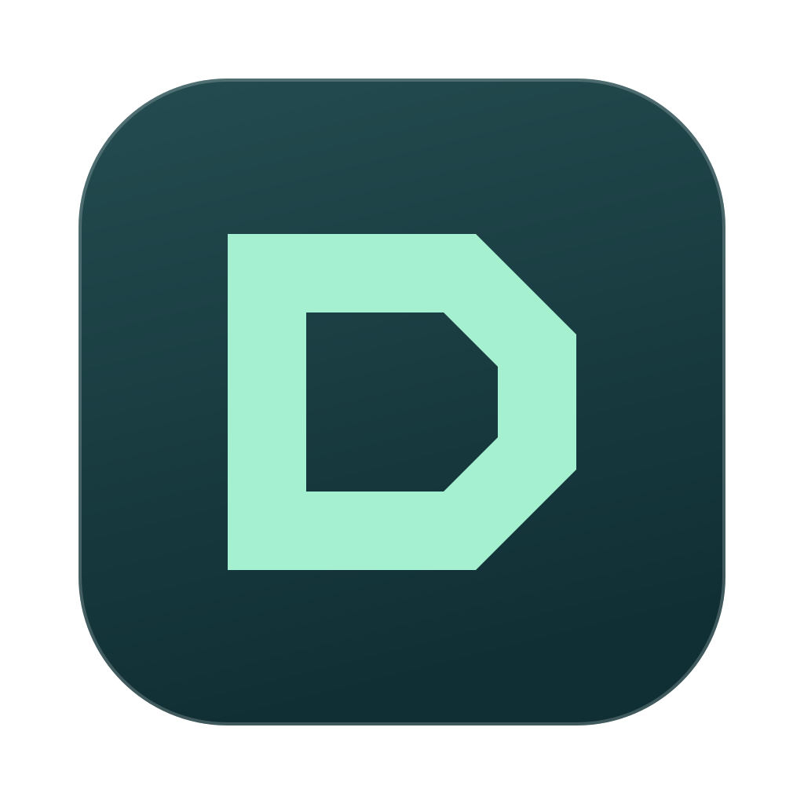

<p align="center">
  
</p>

<h1 align="center">Den</h1>

<p align="center">
  A native environment for working with coding agents, written in Rust.<br>
  A code editor, a multiplexer of persistent terminals and git in one app, on your machine or on any server over SSH.
</p>

<p align="center">
  
</p>

- **Native, in Rust.** GPU-rendered with GPUI, no Electron. On macOS, Linux and Windows.
- **Code editor.** Tree-sitter highlighting, language servers (go to definition, references, completions, signatures, formatting), project search, go to file by name, an outline of the file (its classes, functions and constants, not what's inside them), split editors, Markdown and images. Cmd-click a `file:line` in a terminal to open it.
- **Persistent sessions.** A terminal multiplexer per workspace, with tabs and splits. Every terminal lives in `den-agent`, not in the app, like in tmux. Close Den, update it or lose the connection and Claude keeps working; reopening reattaches each terminal with its screen and history.
- **Remote like local.** A server is a name from `~/.ssh/config`. Den uploads its agent, which runs the terminals, search, git and language servers next to the files; only terminal output and results travel. On Windows, WSL distros work the same way.
- **Git built in.** Every workspace is a folder, a checkout or a worktree, and New Worktree (Cmd-Shift-N) starts one per task. Uncommitted changes, the history of the repo or of a file, side-by-side diffs (in one column when there's no room for two, at a width set in Settings; their right-click menu can keep them side by side or in one column), commits with all their files, and the blame of the current line. Den only reads: commit and push from a terminal.
- **A debugger.** Breakpoints in the gutter (with conditions, hit counts and logpoints), stepping, the values of the variables written in the code as it stops, hover, watches and a console that evaluates and assigns. For any program that speaks [Den's debug protocol](docs/debugger.md), on your machine or on a server.
- **A phone beside the code.** On macOS, the Device panel shows the screen of an iOS simulator or any other phone a program serves with [Den's device protocol](docs/device.md): the mouse is a finger, the keyboard is the phone's, and F10 still steps through the code.
- **Every agent at a glance.** The workspaces of all your servers in one panel, each with a dot for the coding agents (Claude Code, Codex…) running in its terminals: red when one is asking something, yellow while one works, green when they finished unseen. The Agents panel lists them all. No hooks: Den reads the terminals. Cmd-1…9, Cmd-E and Cmd-Alt-E jump between them.
- **Agents drive Den.** With the `den` command, Claude shows you the code it's talking about with the range selected, the diff to review or a Markdown report, reads what you selected, and opens terminals, reads them and types in them. Den installs a Claude Code skill so Claude knows how.

## Install

Download a package from [Releases](https://github.com/scorredoira/den/releases).

| Platform | Package | Installation |
| --- | --- | --- |
| macOS 15+, Apple Silicon | `den-<version>-macos-aarch64.zip` | Unzip and drag `Den.app` to Applications. |
| macOS 15+, Intel | `den-<version>-macos-x86_64.zip` | Unzip and drag `Den.app` to Applications. |
| Linux x86_64, Ubuntu 24.04 or compatible | `den-<version>-linux-x86_64.tar.gz` | Extract and run `./install.sh`, or run `./den` directly. |
| Windows 10/11 x64 | `den-<version>-windows-x86_64.zip` | Extract the whole folder and open `den.exe`. Optional: run `install.ps1` for a per-user install and Start menu shortcut. |

**macOS first launch:** releases are ad hoc signed, without notarization. After trying to open Den, go to System Settings → Privacy & Security → Open Anyway. See [Apple's instructions](https://support.apple.com/102445). A normal download may be blocked until you authorize it.

**Linux:** a graphical Wayland or X11 session and a working Vulkan driver are required. On Ubuntu 24.04, install runtime dependencies with `sudo apt install libfontconfig1 libwayland-client0 libwebkit2gtk-4.1-0 libxkbcommon-x11-0 libx11-xcb1 libssl3t64 libzstd1 libvulkan1`. The optional installer also needs Python 3. Packages built on Ubuntu 24.04 require its glibc baseline; they are not universal binaries for older distributions.

**Windows:** releases are unsigned, so Windows may show a publisher/SmartScreen warning. Install Git for Windows and the Windows OpenSSH client and make `git` and `ssh` available on PATH. The default terminal is PowerShell (PowerShell 7 when installed). Keep the bundled agent next to `den.exe`. Close the app before replacing an installed release. To work inside WSL, add the distro as a server (`wsl:<distro>`, also listed in the server picker): Den installs its Linux agent there and runs files, git, language servers and terminals inside the distro, which it keeps running while the agent has terminals.

Git must be installed on every machine where you use repositories. SSH connections currently support Linux x86_64 servers; every desktop package includes their static agent. Install Claude Code and any language servers you use separately.

Every release includes `SHA256SUMS`. On macOS use `shasum -a 256 <archive>`; on Linux use `sha256sum <archive>`; on Windows use `Get-FileHash <archive> -Algorithm SHA256`.

To build from source, install Rust and the native dependencies from the [GPUI Kit installation guide](https://gpui-kit.com/docs/installation/), then run:

```sh
git clone https://github.com/scorredoira/den && cd den
cargo build --release --locked -p ui -p agent
```

Both executables are in `target/release`. On macOS, `./install` builds and installs `Den.app`; `./run` opens a development build. To include the Linux SSH agent when building on macOS, install `cargo-zigbuild` and Zig first.

## Opening from a terminal

`den <path>` opens a folder, or a file in its repo, as a workspace in Den. It works from any terminal: the agent links `den` into `~/.local/bin` if that folder exists. Over SSH it opens in the app connected to that server, and in Den's terminals in the window of that terminal.

`den -n <path>` opens it in a window of its own instead, also from Den's terminals (on a server, a window on that server). If it's already open in a window, that window comes to the front. Like a `den -s` window, what's open in it isn't remembered unless kept.

`den -s <server> [<path>]` opens a window of its own on a server (a name from `~/.ssh/config` or `user@host`) with the path there, relative to its home folder, or the folder picker without one. That window is for a quick look: its workspaces column starts hidden, and neither the server nor the folders opened in it are remembered once it closes, unless kept with Keep in Workspaces (in its title bar or the server's right-click menu). Running it again for the same server opens in that window.

In Den's terminals, more commands act on the workspace of the terminal they run in, the same over SSH (`den --help` lists them all):

| Command | What it does |
| --- | --- |
| `den where` | Prints as JSON what's in front: the workspace (server, path, repo, branch, worktree or not), its tabs, the panels shown, the Device panel and the debugger's session. |
| `den workspace <path\|name\|branch>` | Brings that workspace to the front. |
| `den close <file>`, `den close --all` | Closes the file's tabs, or all of them; none if one has unsaved changes. |
| `den panel show\|hide <panel>`, `den reveal <file>` | Shows or hides a panel; selects the file in the files panel. |
| `den show <file>:<line>` | Opens the file at that line; `<file>:10-20` or `<file>:10:5-12:3` selects that range. The keyboard stays in the terminal unless `--focus`. |
| `den diff [<file>]` | Shows the uncommitted changes. |
| `den doc [<title>]` | Shows the Markdown read from stdin in a tab. |
| `den selection`, `den tabs` | Print what's selected in the editor, and the open files. |
| `den message <text>` | Shows a message in the status bar. |
| `den notes [add \| set] [<text>]` | Prints the workspace's notes, adds a line to them or replaces them (the text, or stdin). |
| `den workspaces` | Lists the workspaces and whether each is working, waiting for an answer or finished. |
| `den term new [--right\|--down] [<command>]` | Opens a terminal, runs the command in its shell and prints its id. |
| `den term list`, `read <id>`, `send <id> <text>`, `focus <id>`, `close <id>` | Lists, reads, types in, shows and closes terminals. |
| `den debug state`, `inspect`, `start [<file>]`, `break <file>:<line>`, `wait`, `eval <expr>`, `next`, `continue`, `stop`… | Drives the debugger and prints its state as JSON: an agent sets a breakpoint, starts the program, triggers the code and waits for the stop. |

They are meant for coding agents: when `~/.claude` exists, the agent installs a Claude Code skill (`~/.claude/skills/den`) that tells Claude about them. Other agents can read `den --help`. A path that is also a command's name opens with `./`, as in `den ./tabs`.

## Workspaces

The Workspaces panel, at the top of the explorer, lists per server the folders opened and the known repos, a row each: a repo's checkout and its worktrees as `repo / branch`, a folder that isn't a repo by its name. Drag to reorder: a checkout moves along with its worktrees. Its + adds a folder or a server (any name from `~/.ssh/config` or `user@host`), and the + beside a server opens a folder there, or creates one by typing a new name. Hovering a repo's checkout shows a + that makes a new worktree of it, and hovering a worktree, a bin that deletes it (after asking, and warning if it has uncommitted changes or commits not merged into the main branch; if git still refuses, it asks again to force it). Right-click removes them, and a folder that isn't a repo yet can be made one (Initialize Git Repository). Cmd-Shift-B shows or hides it.

New Worktree (Cmd-Shift-N) creates one with the repo's executable `.den/create <name>` if it has one, or `git worktree add` otherwise. From a Den terminal: `cd "$(den worktree <name>)"`. To leave out the worktrees agents make on their own, turn on Only My Worktrees in Settings: the panel then lists only those made with New Worktree.

On Windows, repository hooks can use `.den/create.ps1`, `.den/remove.ps1` and `.den/format.ps1` (also `.cmd`, `.bat` or `.exe`). Extensionless hooks need `sh` on PATH. PowerShell terminals report their current directory automatically; custom shells should emit OSC 7 for directory tracking.

Format Document (Shift-Opt-F), and Format on Save for the types chosen in Settings, use the repo's executable `.den/format <file>` if it has one (the text on stdin, the result on stdout; exiting with 2 leaves that type to the next way), else the language server; JSON is formatted even without either.

Cmd-E goes straight into the next one with a coding agent, in the panel's order, and Cmd-Alt-Shift-E into the next one of all. Cmd-Alt-E switches between the ones being worked on as Cmd-Tab does between apps: the previous one, then those with a coding agent, the ones waiting for an answer first and each the most recently used first (all of them while no other has an agent); holding Cmd, each E goes one further (Shift-E back) and letting go enters it. Cmd-K finds one across servers, the most recently used first. On Linux and Windows these are Ctrl-Alt-E, Ctrl-Alt-Shift-E, Ctrl-Tab and Ctrl-Shift-K, so that Ctrl plus a letter stays the shell's inside a terminal. Every shortcut can be changed in Settings (Cmd-,).

Cmd-D splits a terminal down and Cmd-Alt-D to the right (Ctrl-Alt-D and Ctrl-Shift-5 on Linux and Windows), and Cmd-Alt-arrows move between the panes. Drag a terminal tab to the left, right, top or bottom edge of another terminal to split the area. In a split, drag a pane's title back to the tab bar to separate it again. Escape cancels the drag; sessions and their history stay open.

## Layout

The window has a place for each thing. On the left, the activity bar and the side column; the code in the middle, always; the terminals on its right or, with View > Terminals Under the Code (Cmd-Alt-J, or the terminals' bar right-click), under it; and the Device panel on the far right while it shows.

The activity bar has an icon for each group of the side column: the explorer (Workspaces, Files, Outline and, once shown, Agents), Search (and References), Source Control (Changes and History) and Run and Debug. A click shows its group or, if it's the one showing, closes the column; Cmd-B closes it or brings it back. Drag the icons up or down to reorder them. A group's panels go one above the other: a click on a panel's header folds it to that header, dragged onto another's header it goes above it, and its lower edge, dragged, sizes it; the files, the search, the history and the variables take the height the others leave. Any panel can go in any icon's column: drag its header onto another icon to move it there, or onto another panel's header to put it above; drag an icon onto the column to bring all its panels. Right-click a panel to hide it, or to give it an icon of its own, where it has the column to itself. The bar's right-click menu, and Show Panel in any panel's, lists every panel, checked if it's in the column showing: a click brings it there, from wherever it is, or takes it off. The icons carry what's going on in their group: the number of files changed, the most urgent of the agents and of the other workspaces on the explorer's, and the debugger's state, yellow while stopped and green while running. At its bottom, the notes, Add Server (a host from `~/.ssh/config`, `user@host` or, on Windows, a WSL distro) and Settings.

Each workspace in the Workspaces panel has a dot for the coding agents (Claude Code, Codex, Gemini…) running in its terminals: red when one is waiting for an answer, a half yellow one while one works, green when they finished while you weren't looking, and an empty circle with none running or all idle; its state in words on the right. The Agents panel lists every agent of every workspace and server the same way, with what it's on (Claude Code's title) on hover. A click goes to that terminal.

The side column, what it shows and where things go are the same in every workspace: going from one to another moves nothing. Each workspace keeps whether its terminals and its device show; a new one shows the terminals. Reset Layout (View, or the activity bar's right-click) puts it all back as it starts.

Each workspace has its notes, which open over the window from the activity bar or with Cmd-Alt-N (Esc or a click outside closes them): plain Markdown for what's next there, kept by Den in its config folder, never in the repo, and forgotten when the worktree is removed. Their icon gets a dot while they have something, and Cmd-E shows their first line on the way in.

## Debugging

A workspace says how to start its program in `.den/debug.json`:

```json
{ "command": "sim -d -dp 127.0.0.1:${port} ${file}" }
```

`${file}` is the open file: the program decides what debugging it means (a script, a test, the server it belongs to). `${port}` is a free port the agent picks for this session. F5 runs the command in a terminal and connects to the port. With a fixed `"port"` instead of `${port}`, it attaches when something already answers on it, or when there's no command. With `"open": "http://localhost:<port>/<page>"`, the browser opens that page once the program listens on that port (a server, not a script); on macOS, a Chrome tab already showing that server comes to the front instead. A program started this way stops at its first line, as Visual Studio does (F5 goes on), except a server with `open`, which runs and shows its page as soon as it listens. Its call stack, variables, watches and breakpoints are the Run and Debug group of the side column, with the toolbar at its top; its console is a tab after the terminals'. F9 toggles a breakpoint (or click the gutter; right-click it for a condition, a hit count or a log message), F10 steps over, F11 into, Shift-F11 out, Ctrl-F10 runs to the cursor, Ctrl-Shift-F10 makes the cursor's line the next statement, F6 pauses, Shift-F5 stops and Cmd-Shift-D shows or hides Run and Debug. See [docs/debugger.md](docs/debugger.md).

## Updates

An installed Den (`Den.app` on macOS, or installed with the Linux package's `install.sh`) checks for a new release every few hours and installs it in the background; Settings → Updates turns this off, and Check for Updates still works. It never restarts by itself: the title bar shows a discreet Restart to update button, which asks before restarting. Workspaces and open files reopen as they were, and terminals keep running in the agent across the restart.

## How it's built

Rust and [GPUI](https://www.gpui.rs) with [gpui-component](https://github.com/longbridge/gpui-component). The app only draws; every machine runs `den-agent`, which keeps the terminals and does search, git and LSP next to the files, over a local socket or `ssh`. `plan.md` has the design and what's left.

## Publishing releases

CI builds, tests and packages macOS Apple Silicon, macOS Intel, Linux and Windows on every branch push and pull request. Packages can be downloaded from the successful workflow's artifacts before publishing. No signing certificates or extra repository secrets are needed.

Once your changes are committed, publish a new version from the repository root:

```sh
./release 0.1.1
# Windows: python packaging/release.py 0.1.1
# Preview without changes: ./release 0.1.1 --dry-run
```

This updates the workspace version and lockfile, creates a version commit and an annotated tag, and pushes the branch and tag together. The `Release` workflow runs the tests and publishes all four packages with checksums and generated release notes only after every build succeeds. Use a version such as `0.2.0-beta.1` for a prerelease. Publishing takes several minutes; the first build is slower while caches fill.

Alternatively, update `Cargo.toml` and `Cargo.lock`, commit and push, then open **Actions → Release → Run workflow** on that branch. It publishes the version in `Cargo.toml` and creates its tag. A manually pushed `v<version>` tag also triggers publication; the tag must match the manifest. Existing releases are never overwritten. Uploads are assembled in a draft before becoming public; if an upload fails, delete that incomplete draft before rerunning the publication. If a build fails before publication, fix the failure and use a new version, or rerun a transient failure on the same commit.

macOS packages use ad hoc signing and Windows packages are unsigned. GUI behavior and installation should also be checked on real machines; CI tests the code and builds packages but does not exercise a real desktop session.

## License

GPL-3.0. Inspired by [herdr](https://github.com/herdrdev/herdr) (Apache-2.0), whose rules for detecting when Claude Code is waiting for an answer Den uses, with code adapted from [Zed](https://github.com/zed-industries/zed) (GPL-3.0).
